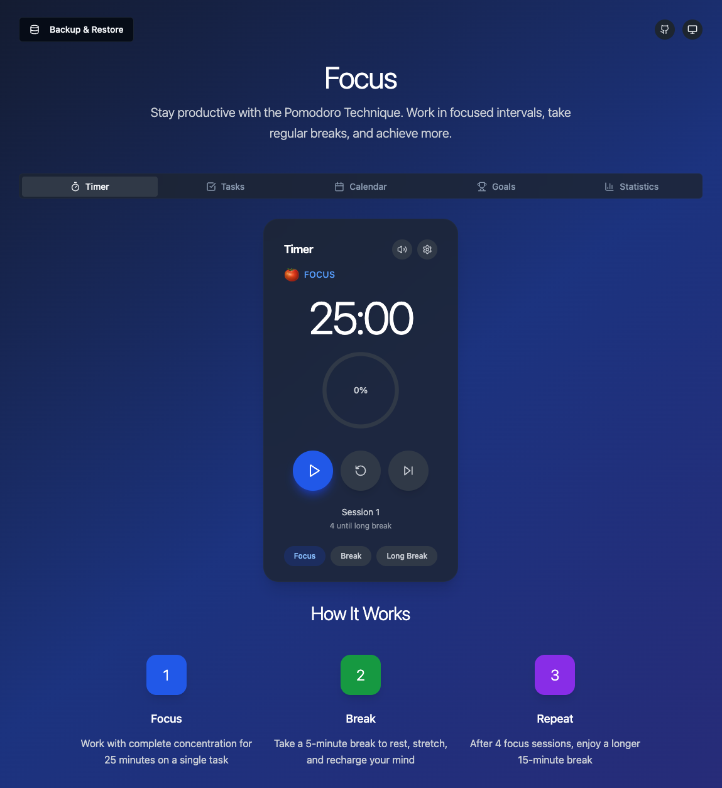

<div align="center">

# 🍅 Focus

**A Beautiful, Feature-Rich Pomodoro Timer for Maximum Productivity**

[](https://www.gnu.org/licenses/agpl-3.0)
[](https://reactjs.org/)
[](https://www.typescriptlang.org/)
[](https://tailwindcss.com/)

[🚀 Live Demo](https://focus.rawveg.co.uk) • [📖 Documentation](#features) • [🐛 Report Bug](https://github.com/rawveg/focus/issues) • [💡 Request Feature](https://github.com/rawveg/focus/issues)

---

*Transform your productivity with the power of focused work sessions, intelligent task management, and comprehensive progress tracking.*

</div>





## ✨ Features

### 🎯 **Pomodoro Timer**
- **Customizable Sessions** - Adjust work, short break, and long break durations
- **Smart Persistence** - Timer continues running even when you close the browser
- **Audio Notifications** - Optional sound alerts for session transitions
- **Auto-Start Options** - Automatically begin breaks or work sessions
- **Visual Progress** - Beautiful circular progress indicator with real-time updates
- **Session Tracking** - Complete history of all your focus sessions

### 📋 **Task Management**
- **Intelligent Task Linking** - Connect Pomodoro sessions to specific tasks
- **Progress Tracking** - Monitor completed vs. estimated Pomodoros per task
- **Task Completion** - Mark tasks as done with celebration notifications
- **Flexible Organization** - Add descriptions and estimate effort for each task
- **Visual Progress Bars** - See task completion at a glance

### 📅 **Calendar Integration**
- **Session Scheduling** - Plan your focus sessions in advance
- **Monthly View** - Visual calendar showing all scheduled activities
- **Task Linking** - Connect scheduled sessions to your tasks
- **One-Click Start** - Launch scheduled sessions directly from the calendar
- **Session Types** - Schedule work sessions, breaks, or long breaks
- **Today's Focus** - Dedicated view for today's planned activities

### 🏆 **Goals & Achievements**
- **16+ Achievements** - Unlock badges for various productivity milestones
- **Rarity System** - Common, Rare, Epic, and Legendary achievements
- **Daily/Weekly/Monthly Goals** - Set and track productivity targets
- **Streak Tracking** - Build and maintain productive habits
- **Progress Visualization** - See your journey toward each achievement
- **Gamification** - Make productivity fun and engaging

### 📊 **Advanced Analytics**
- **Comprehensive Statistics** - Track sessions, focus time, and productivity trends
- **Streak Analysis** - Monitor your consistency over time
- **Weekly/Monthly Reports** - Detailed breakdowns of your productivity
- **Visual Charts** - Beautiful graphs showing your activity patterns
- **Export Capabilities** - Download your data as CSV for external analysis

### 🎨 **Beautiful Design**
- **Dark/Light Themes** - Seamless theme switching with system preference detection
- **Responsive Design** - Perfect experience on desktop, tablet, and mobile
- **Glass Morphism** - Modern, elegant UI with backdrop blur effects
- **Smooth Animations** - Delightful micro-interactions throughout the app
- **Accessibility** - Built with screen readers and keyboard navigation in mind

### 💾 **Data Management**
- **Complete Backup System** - Export all your data as JSON
- **Selective Exports** - Export only tasks, sessions, or settings
- **Import/Restore** - Restore from backups with merge or replace options
- **Local Storage** - All data stored securely in your browser
- **Cross-Device Sync** - Use backup/restore to sync between devices

## 🚀 Getting Started

### Prerequisites

- **Node.js** (v18 or higher)
- **npm** or **yarn**

### Installation

1. **Clone the repository**
   ```bash
   git clone https://github.com/rawveg/focus.git
   cd focus
   ```

2. **Install dependencies**
   ```bash
   npm install
   # or
   yarn install
   ```

3. **Start the development server**
   ```bash
   npm run dev
   # or
   yarn dev
   ```

4. **Open your browser**
   
   Navigate to `http://localhost:8080` to see the app in action!

### Building for Production

```bash
npm run build
# or
yarn build
```

The built files will be in the `dist` directory, ready for deployment.

## 🎯 How to Use

### 1. **Start Your First Session**
- Click the play button on the timer
- Focus on your work for 25 minutes
- Take a 5-minute break when the timer rings
- Repeat for maximum productivity!

### 2. **Manage Your Tasks**
- Navigate to the "Tasks" tab
- Add tasks with estimated Pomodoro counts
- Select a task before starting your timer
- Watch your progress grow with each completed session

### 3. **Schedule Your Day**
- Use the "Calendar" tab to plan ahead
- Schedule focus sessions at specific times
- Link sessions to your tasks for better organization
- Start scheduled sessions with one click

### 4. **Track Your Progress**
- Check the "Goals" tab for achievements and daily targets
- View detailed statistics in the "Statistics" tab
- Export your data for external analysis
- Celebrate your productivity milestones!

## 🛠️ Tech Stack

- **Frontend Framework**: React 18 with TypeScript
- **Styling**: Tailwind CSS with shadcn/ui components
- **State Management**: React Hooks with localStorage persistence
- **Build Tool**: Vite for fast development and building
- **Icons**: Lucide React for beautiful, consistent icons
- **Animations**: CSS transitions and transforms

## 📱 Browser Support

Focus works on all modern browsers:

- ✅ Chrome (recommended)
- ✅ Firefox
- ✅ Safari
- ✅ Edge
- ✅ Mobile browsers (iOS Safari, Chrome Mobile)

## 🤝 Contributing

We love contributions! Here's how you can help make Focus even better:

### 🐛 **Bug Reports**
Found a bug? Please [open an issue](https://github.com/rawveg/focus/issues) with:
- A clear description of the problem
- Steps to reproduce the issue
- Your browser and operating system
- Screenshots if applicable

### 💡 **Feature Requests**
Have an idea for a new feature? [Create an issue](https://github.com/rawveg/focus/issues) and describe:
- The feature you'd like to see
- Why it would be useful
- How you envision it working

### 🔧 **Code Contributions**

1. **Fork the repository**
2. **Create a feature branch**
   ```bash
   git checkout -b feature/amazing-feature
   ```
3. **Make your changes**
   - Follow the existing code style
   - Add tests if applicable
   - Update documentation as needed
4. **Commit your changes**
   ```bash
   git commit -m "Add amazing feature"
   ```
5. **Push to your branch**
   ```bash
   git push origin feature/amazing-feature
   ```
6. **Open a Pull Request**

### 📋 **Development Guidelines**

- **Code Style**: We use TypeScript and follow React best practices
- **Components**: Create small, focused, reusable components
- **Styling**: Use Tailwind CSS classes and shadcn/ui components
- **State**: Prefer React hooks and localStorage for persistence
- **Testing**: Test your changes across different browsers

## 📄 License

This project is licensed under the **GNU Affero General Public License v3.0** - see the [LICENSE](LICENSE) file for details.

### What this means:
- ✅ **Free to use** for personal and commercial purposes
- ✅ **Free to modify** and distribute
- ✅ **Source code must remain open** if you distribute the software
- ✅ **Network use is distribution** - if you run this on a server, you must provide source code

## 🙏 Acknowledgments

- **Pomodoro Technique** - Created by Francesco Cirillo
- **shadcn/ui** - For the beautiful component library
- **Lucide** - For the amazing icon set
- **Tailwind CSS** - For making styling a joy
- **React Team** - For the incredible framework

## 📞 Support

- 🐛 **Issues**: [GitHub Issues](https://github.com/rawveg/focus/issues)
- 💬 **Discussions**: [GitHub Discussions](https://github.com/rawveg/focus/discussions)

---

<div align="center">

**Made with ❤️ by [Tim Green](https://github.com/rawveg)**

*If Focus helps boost your productivity, consider giving it a ⭐ on GitHub!*

[⬆ Back to Top](#-focus)

</div>
